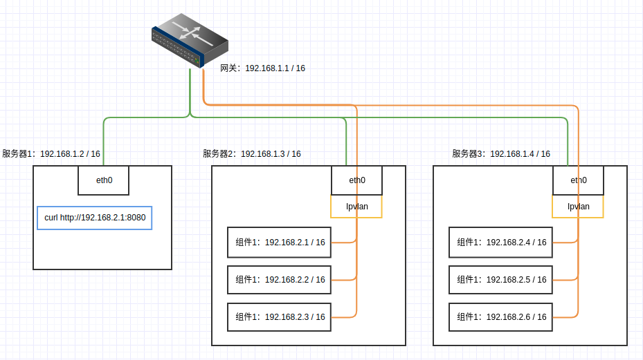

# 自建数据仓库基础组件


## 组件列表

1. [hadoop-hdfs集群](./hadoop-hdfs)：hadoop的HDFS组件
1. [hadoop-yarn集群](./hadoop-yarn): hadoop的yarn组件
1. [hive-on-mr](./hive-on-mr)：基于`MapReduce`的hive2 server
1. [spark-standalone-cluster](./spark-standalone): spark独立集群
1. [kafka-on-kraft](./kafka-on-kraft): 基于 `kraft`的`Kafka`集群
1. [elasticsearch集群](./elasticsearch)：elasticsearch集群及kibana服务
1. [Logstash服务](./logstash)：`logstash`基础程序, 日志输出到 `kafka`与`hdfs`


## 网络

组件网络使用`ipvlan l2`搭建，可以实现跨主机网络访问，

假设组件使用`192.168.2.1/24`网段

网络结构图



具体网段可以根据实际情况修改，组件与服务器处于同一网段即可

如果是在同一台机器上，创建普通网络也是可以的，需要避免和服务器网段冲突

### 创建网络

在需要部署组件的机器上创建网络，

```bash
    # 创建ipvlan l2网络，跨服务器访问
    docker network create -d ipvlan --subnet=192.168.1.1/16 --gateway=192.168.1.1 -o ipvlan_mode=l2 -o parent=eth0 hostvpc

    # 创建普通网络，组件使用192.168.2.1/24网段
    docker network create --subnet=192.168.2.1/24 --gateway=192.168.2.1 hostvpc
```


### 域名解析

为了方便组件之间通信，以及服务访问，设定以下域名解析, 假设域名在`example.com`下

```python
    # hdfs
    192.168.2.10 nn.hdfs.example.com
    192.168.2.11 dn01.hdfs.example.com
    192.168.2.12 dn02.hdfs.example.com
    192.168.2.13 dn03.hdfs.example.com
    192.168.2.14 dn04.hdfs.example.com

    # yarn
    192.168.2.20 rm.yarn.example.com
    192.168.2.21 nm01.yarn.example.com
    192.168.2.22 nm02.yarn.example.com
    192.168.2.23 nm03.yarn.example.com
    192.168.2.24 nm04.yarn.example.com
    192.168.2.29 hs.yarn.example.com

    # es
    192.168.2.30 kibana.example.com
    192.168.2.31 es01.example.com
    192.168.2.32 es02.example.com
    192.168.2.33 es03.example.com
    192.168.2.34 es04.example.com

    # spark
    192.168.2.40 master.spark.example.com
    192.168.2.41 w01.spark.example.com
    192.168.2.42 w02.spark.example.com
    192.168.2.43 w03.spark.example.com
    192.168.2.44 w04.spark.example.com

    # kafka
    192.168.2.51 kafka01.example.com
    192.168.2.52 kafka02.example.com
    192.168.2.53 kafka03.example.com
    192.168.2.54 kafka04.example.com

    # hive
    192.168.2.60 hive2.example.com
```
